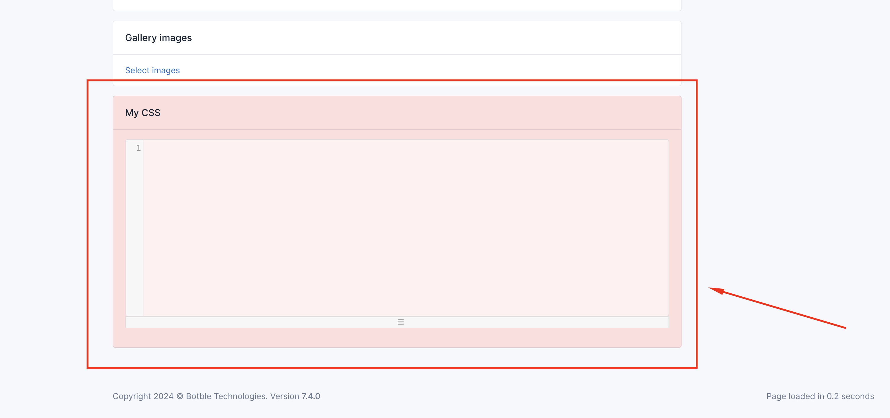

  

# Botble My Style

This is a plugin for Botble CMS so you have to purchase Botble CMS first to use this plugin.

## Screenshot

## Install

- For developers:
    - Rename folder `botble-my-style-main` to `my-style`.
    - Copy folder `my-style` into `/platform/plugins`.
    - Or go to Admin Panel -> Plugins and activate plugin My Style.
    
